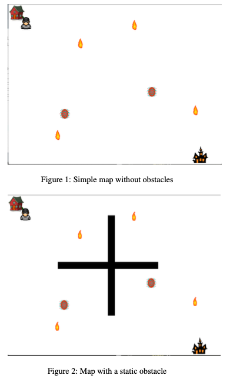
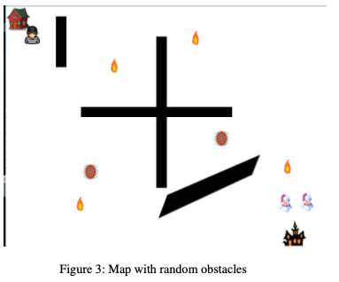

# Game development: Treasure Hunt

An AI game built from scratch in Python with extensive object-oriented programming. Integrated physics like movements, acceleration, and collision detection. Simulated human player pursuing a treasure against AI guard bots using path-finding of A* and RBFS and decision-making algorithms of Goal-Oriented Action Planning using Iterative Deepening A* and Behavior Trees.

- [Game development: Treasure Hunt](#game-development--treasure-hunt)
  * [Overview](#overview)
  * [Game Design](#game-design)
    + [Path-finding](#path-finding)
      - [A-star Algorithm](#a-star-algorithm)
      - [Recursive Best First Search](#recursive-best-first-search)
    + [Decision-making](#decision-making)
      - [Behavior Trees](#behavior-trees)
      - [Goal Oriented Action Planning (GOAP) using Iterative deepening A* (IDA*)](#goal-oriented-action-planning--goap--using-iterative-deepening-a---ida--)
  * [Demonstration](#demonstration)

<small><i><a href='http://ecotrust-canada.github.io/markdown-toc/'>Table of contents generated with markdown-toc</a></i></small>

## Overview
It is a game equipped with artificial intelligence involving a human player and some AI bots. The movement of the bots would be planned and automated through AI algorithms. This is a zero-sum game wherein the aim of the human player is to steal the treasure from the haunted house and bring it back to the safe-house. The treasure is initially guarded by one or more AI bots. The computer bots use decision making algorithm to decide among various actions like chasing the human player to kill it, defend the treasure or just wander aimlessly depending upon the state of the game. The decisions are supported by pathfinding algorithms from their position to the prospective destinations. There are some static and some randomly moving obstacles, and random power-ups in the game.

## Game Design

The game has been designed in a way that would extensively make use of path-finding, decision making and path planning algorithms. This facilitated us to clearly evaluate the performance of different algorithms for any given task. When the game begins with a (human) player at the safe house, there are two guards (enemy bots) protecting the treasure. The human player moves manually with direction arrow keys. The challenge for human player is to prevent themselves from colliding with the guards or dangerous obstacles and traps that come in the way. If the enemy bots catch the player, the player loses the game. If the player successfully brings the treasure back, the player wins the game. The world map also begins with four deadly and two not harmful (non-deadly) static danger spots. These numbers may increase or decrease subject based on whether certain special power ups as secured by the player or the bots as the game progresses.

### Path-finding
We evaluate the performance of path-finding algorithms by varying the level of obstacles in the map. This ranges from no obstacles at all to complicated obstacle shapes which effectively tests the path-finding algorithms based on time consumed and the memory consumed in finding the path. The game would use several algorithms, namely, A-star algorithm and Recursive Best First Search algorithm. We evaluate the performance of these algorithms in different scenarios and based on different parameters. From the perspective of game-play, these variations would also introduce increase level of difficulty which would be directly related to increasing level of efficiency of the bots

#### A-star Algorithm

A-star algorithm proves to be a powerful algorithm when the task is to find the shortest distance between the given source and a single the target location. This algorithm proves to be very efficient for a grid graph. Unlike Dijkstra’s algorithm, this algorithm trims down the number of sub-paths smartly by taking into consideration a heuristics function. The heuristics function gives an estimate to the remaining distance from the current neighbour to the final target. The heuristic could be the Euclidean distance, Manhattan distance or any other metric depending on the graph.

In our case, we have a grid graph with some inaccessible points represented by obstacles. Had it been a graph without obstacles, the path could be a straight line from the source coordinates to the destination coordinates and a Greedy Best Search would also work. The presence of obstacles requires the path to circumvent around the obstacle and traversing the minimum possible distance at the same time. We evaulated the performance of A-star in varying level of obstacles forcing the algorithm to find convoluted paths resulting in high memory stack.
In our game, A-star algorithm is implemented for the guard bots as the source coordinates. The target coordinates could be the position of the human player, a power-up or any other key location as decided by the decision-making algorithm.

#### Recursive Best First Search
The Recursive best first search is a type of informed search strategy. As we know that, the recursive best first search algorithm was created to mimic the operation of a standard best first search algorithm which also uses heuristic to get to the goal node in shortest possible path. But, the main motive was to create an algorithm that could do that using linear space.

This algorithm runs similar to recursive depth first search, but it does not go indefinitely down the path as depth first search does. It uses an f limit feature value to limit the depth of the recursive subcalls. Thus, whenever the algorithm finds out the f values of the nodes is increasing above the threshold f limit value, it start to backtrack to find the next biggest f limit value and then starts to traverse recursively from that node. So, in other words this f limit value is used to keep track of best alternative track available from any ancestor of the current node from where the recursion has started.
If the heuristic chosen for this algorithm is admissible then the algorithm is both optimal and complete. That means the algorithm will always find the optimal path from the start node to the goal node if there exists one and complete because it will return failure if there is no such path. The time complexity and space complexity of this algorithm will be highlighted in the results and interpretation section of this document.

### Decision-making
The AI bots based on their current behavior, decided by decision-making algorithms, would either play defensive, in which case they will try to be in the vicinity of the treasure, or play attacking, in which case they will try to kill the human player, or play neutral, in which case they will just wander around aimlessly depending the proximity of the player
to them or the player’s goal. The decision making algorithms for the bots would have different goals and set of possible actions based on the current state of the game which could potentially be a combination of some of the above states.

#### Behavior Trees
The behavior tree represents all possible actions that a character can take. The route from the top level to each leaf represents one course of action and the behavior tree algorithm searches among those courses of action in a left-to-right manner. In other words, it performs a depth-first search and that is why is it also called Depth First Reactive Planning.
A node in behavior tree can be a Condition, Action, Composite Tasks such as a selector (kind of like an OR gate) or a sequencer (kind of like an AND gate), or a decorator. A decorator usually has only one child. We have modified our decorator to have multiple children but during execution
only one of them is selected based on their respective probability, making it a kind of non-deterministic random selector. Consider an example: Initially, the player is in the first quadrant - in this situation, the guards can either protect the treasure by moving to and fro guarding around the Haunted House with some probability (say, p) or wander around the map with probability (1-p). Similarly, at different point in time, the available actions for the bots change and while iterating the behavior tree a randomly suitable action will be chosen based on current state of the game. All of these probability values are dynamic and can be tweaked or configured as required. An online learning algorithm could be used to improve these parameters but it is outside the scope of our focus in this work.

#### Goal Oriented Action Planning (GOAP) using Iterative deepening A* (IDA*)
In a game, a character may have one or more goals, also called motives. There may be hundreds of possible goals, and each character may have any number of them active at a given point in time. Each goal has a level of importance, called an insistence. A goal with high insistence will tend to influence the character’s behavior more strongly. A character will try to fulfill a goal or reduce its insistence. In addition to a set of goals, there are a set of possible actions to choose from in order to achieve that goal.

For any A∗, we need a heuristic function that estimates how far a state space node is from having the goal fulfilled. When the treasure is not stolen a random target location near the Haunted house is selected so as to protect the treasure. And when the treasure is stolen, we try to guess where the human will go based on his current speed on the line joining his position and safe house’s position. Then, we think of all the ways we can reach that point - go directly, or pick-up a power-up, or don’t go at that point altogether and rather move back and forth near the safe hoping that player strikes us, etc. based on the time it’ll take to do the action and the insistence value. Now this needs to be fast so have a max depth cut off and current search cut off. Also, we also keep transposition table to avoid searching the same set of actions
over and over in each depth-first search. The hash value for the table is chosen as the action code that was last taken and the combination of python’s id(state space object) as it is guaranteed to be unique and constant for this object during its lifetime. So, that if we come across same object we can either choose to ignore it or take a different action if the depth thresholds would get exceeded.

## Demonstration
Click [here](https://drive.google.com/file/d/1Jbya3wxzWGOmJF4I3PHVPqXfhKVSP6KC/view) for a demo of the gameplay and its features.

